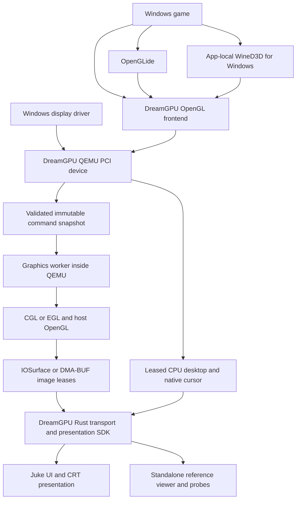

# DreamGPU architecture

DreamGPU is the graphics implementation; [Juke](https://github.com/anderstorpsfestivalen/juke) is a VM desktop application
used as one consumer and integration test harness.
The Rust SDK builds without Juke, QEMU, Windows installations or game media.
QEMU and guest builds use DreamGPU's pinned sources and build recipes. Runtime
acceptance and remaining compatibility work are recorded in [progress.md](progress.md),
not inferred from this architecture description.

## Processes and data flow



There is no additional graphics daemon or per-command process hop. The render
worker belongs to QEMU; native image handles travel to the presentation process.
Guest commands contain protocol values, never host addresses.

The QEMU device is `dreamgpu` and the shared-memory display is `dreamgpu-shmem`.
Audio remains owned by the consuming application; the shared QEMU fork retains
Juke's existing `juke` audio backend. Guest frontend and driver filenames use
8.3-compatible short names such as `dgpugl.dll`, `dgpumini.sys`, and `dgpudisp.dll`.
`dgpu` is the constrained short form of the project name.

Numeric PCI identity, register offsets, opcodes, function IDs, wire versions and
layouts remain unchanged by the naming migration. QEMU device/migration names,
DLL/module/service identifiers and diagnostic trace names are coordinated textual
interfaces. Use the renamed host and guest package together with cold boot and
new snapshots. Historical measurements retain the binaries and names they tested.

## Code ownership

| Area | Implementation and responsibility |
| --- | --- |
| Root `dreamgpu` package | Frame leases, cursor contracts, native transport, CPU display/input wire transport, bounded tracing and optional wgpu presentation integration |
| `crates/dreamgpu-host` | Rust engine linked statically into QEMU; bounded 2D planning, desktop/cursor validation, GL registry/dispatch, payload validation, scalar/vertex execution and texture namespace, lifetime, upload and synchronization logic |
| `vendor/qemu` | QEMU device lifecycle, DMA, interrupts, migration, platform graphics glue and remaining native implementation being migrated |
| `guest/` | Runtime display drivers, OpenGL frontend, shared guest headers and WineD3D/OpenGLide adaptations |
| `tools/` | Guest executables for installation, diagnostics, API probes and automated games |
| `support/guest/` | Source/compiler pins, cross-toolchain recipe and frontend/translator build support |
| `tests/guest/` | Source-level driver, frontend and translator checks |
| `scripts` | Dependency preparation, native/guest builds, artifact packaging and repeatable fixture/benchmark control |
| Juke | VM management, application input routing/audio, UI, CRT effects and adaptation to the SDK |

The host rewrite is incremental. CGL/EGL context creation, drawable attachments,
image export and portions of query/vector execution still live in QEMU's platform
implementation. Rust now owns texture namespaces, references, upload accounting
and cross-context texture synchronization through the native GL function table.
Rust calling a platform C ABI is an
intentional boundary, not a requirement to rewrite the operating system or upstream
QEMU/Wine.

The root package's `presentation` Cargo feature selects the wgpu integration for
consumers that need it. Protocol and transport consumers do not need a windowing
stack. It is a dependency boundary, not a slower alternate runtime implementation.

## Frame ownership and desktop authority

A `FrameLease` owns a stable CPU pixel snapshot; `FrameStorage` separately retains
its mapping for native imports. Retaining a cached allocation must not keep its
producer slot permanently occupied. `GpuFrameLease` similarly retains the native
image and producer credit until the last consumer finishes.

The transport has two distinct forms of work:

- A latest complete-frame mailbox may discard superseded complete images.
- Ordered `DesktopBatch` operations are reliable and bounded. Dropping an operation
  could break later patches, reads or resource releases, so they never enter the
  complete-frame mailbox.

Each desktop epoch starts with a seed and sequence 1. Patches, fills, copies,
clipped drawable blits, readbacks and return-to-CPU operations retain stream order.
A drawable is an offscreen resource; receiving it alone does not establish desktop
visibility or authority. Reset and CPU handoff markers prevent an independently
arriving old CPU frame from replacing a newer composed desktop.

On macOS, the consumer imports IOSurface into Metal. On Linux, it validates and
imports the DMA-BUF on the matching Vulkan device, observes producer synchronization,
copies on the GPU into compositor storage and returns foreign ownership. Neither
path requires CPU pixel readback for normal GPU presentation. Unified memory does
not eliminate synchronization, producer leases or all GPU copies.

`DesktopCanvas` runs independently of a window surface. A minimized or unselected
VM must still complete required guest reads and resource lifecycle operations.
Juke retains its application-specific choice of which VM to present.

## Input, scheduling and diagnostics

DreamGPU owns fixed-wire input queues and their sleeping I/O worker. Juke decides
which VM receives an application event and retains other input routing policy.
Motion can coalesce without reordering discrete key/button events; overload resets
held state rather than silently losing releases.

Render, transport and completion work use bounded queues. Producer release callbacks
enqueue work rather than writing to sockets or waiting. Idle workers sleep. Actual
CPU pixel reads use explicit readback requests; they must not be disguised as normal
presentation or allowed to wait for a visible window.

The shared `perf` module owns the bounded recorder. Juke reexports the same recorder,
so extraction does not create two disconnected trace sessions. Runtime trace names
and flow identifiers remain usable by the existing automation.

## Source and build alignment

Juke develops against the literal local Cargo path. The root package has
`links = "dreamgpu"`; its build script emits `DEP_DREAMGPU_ROOT` for dependent
native build scripts. Native QEMU construction therefore follows the checkout
selected by Cargo rather than a second hardcoded source path.

The SDK's `native::source_root()` gives consumers that same checkout at runtime;
`native::binary_in()` resolves its signed/unsigned build artifacts without searching
system `PATH`. Juke's backend, `lift` command and development paths share one resolver.
Explicit `JUKE_QEMU_PREBUILT` and `JUKE_QEMU_BUILD_DIR` overrides remain available for
frozen fixtures, captured by Juke core's build script and accepted at runtime. Relative
overrides are anchored to the Juke workspace root. A configured per-VM binary name
selects that architecture from the chosen directory. Application bundles use their
own binaries before development overrides.

Juke's Python smoke tooling and bundle script read the same Cargo path dependency.
The macOS bundle copies QEMU's complete `qemu-bundle` firmware tree with symlinks
dereferenced, retaining the configured prefix structure that QEMU uses for relocation.
It does not depend on either source checkout remaining installed.

`include/dreamgpu/transport.h` and `cursor.h` are the small MIT canonical
consumer contracts. SDK numeric transport constants are generated at build time.
Native builds check the copies consumed by QEMU. The GL vocabulary and host GL ABI
bindings have their own provenance and generation process under
`crates/dreamgpu-host/bindings/`; ordinary builds use the checked-in bindings.

Submodule commits, patch provenance, compiler versions and package manifests belong
to DreamGPU. Windows installations, games, snapshots and credentials remain external
fixtures. macOS can build the Rust SDK/native host locally and invoke the configured
Linux builder for guest packages; that machine is not an SDK dependency.

## Standalone verification

Run from the DreamGPU checkout:

```sh
# Portable contracts, transport and host-engine logic.
cargo test -p dreamgpu --features presentation
cargo test -p dreamgpu-host

# Bounded one-presentation SDK smoke test; no guest required.
cargo run --features presentation --example viewer -- --smoke

# Explicit native GPU import/composition tests.
cargo test -p dreamgpu --features presentation --lib presentation:: -- --ignored --test-threads=1
cargo test -p dreamgpu --features presentation --test desktop -- --ignored --test-threads=1

# Linux: EGL export + native fence + Vulkan import and resource release.
cargo test -p dreamgpu --features presentation --test linux-dmabuf -- --ignored --test-threads=1

# Diskless device-to-renderer acceptance after building a coherent QEMU candidate.
cargo test -p dreamgpu --features presentation --test native_qemu -- --ignored --test-threads=1
```

`DREAMGPU_QEMU_PATH` can select a specific frozen native candidate for the diskless
suite; otherwise it uses `target/qemu-build/qemu-system-x86_64`. Test ownership,
recorded artifact identity and cleanup are part of acceptance. The standalone viewer
consumes native image/ordered-desktop transport; Juke remains the complete VM UI and
game-performance verifier.

Run only gates affected by a change. A passing run is evidence to retain, not a
reason to repeat the same benchmark. Use the existing serial/QMP controllers and
direct game workloads; screenshots are evidence rather than a navigation loop.
